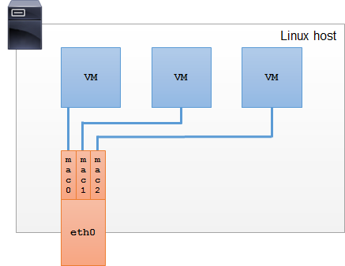

# Use NetworkPolicy in Kubernetes

## Network terms and basic concept

- OSI layers

Each layer in the OSI model serves the layer above it. There are seven layers in total in the OSI model. Here’s a quick rundown of each of them:

1. The physical layer: Layer one is concerned with the transmission of data bits over physical mediums.
1. Data link: Layer two specifies transmission of frames between connected nodes on the physical layer.
1. Network: Addressing, routing and traffic control of a multi-node network is described by Layer three.
1. Transport: Segmentation, acknowledgement and multiplexing between points on a network is defined at Layer four.
1. Session: Layer five looks at the continuous exchange of data between two nodes
1. Presentation: Encoding, data compression and encryption / decryption between a network service and application happens at Layer six.
1. Application: Resource sharing, high level APIs and remote file access is defined by Layer seven.

Layers 1, 2 and 3 are Media Layers while layers 4, 5, 6 and 7 are Host Layers.

- L2

Layer 2 is a broadcast Media Access Control (MAC) MAC level network.
Layer 2 defines the protocol to both establish and terminate a physical connection between two devices. Under IEEE 802, Layer 2 can be divided into two sublayers. The MAC approves devices to access and transmit media, while the Logical Link Layer (LLC) first identifies protocols on the network layer and then checks for errors and frame synchronisation.

Layer 2 networks forward all their traffic, including ARP and DHCP broadcasts, so data transmitted by one device on L2 will be forwarded to all devices on the network. This type of broadcast traffic is very fast, but as the network gains in size it creates congestion and leads to inefficiency over the network.

- L3

Router, Layer 3 works on top of Layer 2
Where Layer 3 works with IP addresses, Layer 2 works with MAC addresses. MAC addresses are unique identifiers for the network adaptor present in each device. As IP addresses are a layer of abstraction higher than MAC addresses, they are necessarily ‘slower’ (theoretically – to our human experience, it’s academic). IP addresses are also ‘leased’ or ‘assigned’ generally by a DHCP server. A MAC address is a fixed address to the network adaptor and can’t be changed on a device without changing the hardware adaptor.

To make an analogy, a house address is always the same, like a MAC address, while an IP address can change, like the addressee at the house.

Layer 3 traffic restricts broadcast traffic. Administrators on L3 can segment networks and restrict broadcast traffic to subnetworks, limiting the congestion of broadcast on large networks.

Compared to the L2 broadcast, here’s the L3 process: For each datagram (package of data) send on L3, the IP portion is read by stripping the data link layer (L2) frame information and then reassembled again. From there, the hop count is decremented, the header checksum recalculated and a routing lookup executed. As you can see, it’s a little more involved than L2.

- Hub in L2

The device used in L2 is Hub.

- Switch vs Router in L3

Layer 3 switch or router: What’s the difference?
On the surface, routers and Layer 3 switches share a lot of the same attributes. Both options offer the same routing protocols by accessing incoming data packets and making dynamic routing decisions based on the relevant source and destination addresses.

The main difference between them is in the hardware, as a Layer 3 switch offers all of the capabilities of a switch but only some of the facilities of a router. Although this may sound like a negative, the fact is that Layer 3 switches were built for improved performance in LANs by ditching some of the complexities routers are held to. As such, a Layer 3 switch can offer faster data transfers and can avoid network congestion within a LAN better than a router by skipping some steps in data verification. A Layer 3 switch also doesn’t have any wide area network (WAN) ports and so must stick to VLANs.

Similar to the decision between a Layer 2 or a Layer 3 switch, the question comes down to the application. If you are a large organisation with multiple offices, data centres and WANs you will require a router to allow those infrastructures to communicate. If that’s not the case and you’re solely using VLANs with intranet environments that have outgrown a Layer 2 switch then the Layer 3 switch was purpose-built to fit your needs.

Refer [here](https://www.aussiebroadband.com.au/blog/difference-layer-3-layer-2-networks/) for details.

- BGP

Border Gateway Protocol (BGP) is a standardized exterior gateway protocol designed to exchange routing and reachability information among autonomous systems (AS) on the Internet.[1] The protocol is classified as a path vector protocol.[2] The Border Gateway Protocol makes routing decisions based on paths, network policies, or rule-sets configured by a network administrator and is involved in making core routing decisions.

BGP may be used for routing within an autonomous system. In this application it is referred to as Interior Border Gateway Protocol, Internal BGP, or iBGP. In contrast, the Internet application of the protocol may be referred to as Exterior Border Gateway Protocol, External BGP, or eBGP.

BGP neighbors, called peers, are established by manual configuration among routers to create a TCP session on port 179. A BGP speaker sends 19-byte keep-alive messages every 60 seconds[5] to maintain the connection.[6] Among routing protocols, BGP is unique in using TCP as its transport protocol.

When BGP runs between two peers in the same autonomous system (AS), it is referred to as Internal BGP (i-BGP or Interior Border Gateway Protocol). When it runs between different autonomous systems, it is called External BGP (eBGP or Exterior Border Gateway Protocol). Routers on the boundary of one AS exchanging information with another AS are called border or edge routers or simply eBGP peers and are typically connected directly, while i-BGP peers can be interconnected through other intermediate routers. Other deployment topologies are also possible, such as running eBGP peering inside a VPN tunnel, allowing two remote sites to exchange routing information in a secure and isolated manner. The main difference between iBGP and eBGP peering is in the way routes that were received from one peer are propagated to other peers. For instance, new routes learned from an eBGP peer are typically redistributed to all iBGP peers as well as all other eBGP peers (if transit mode is enabled on the router). However, if new routes are learned on an iBGP peering, then they are re-advertised only to all eBGP peers. These route-propagation rules effectively require that all iBGP peers inside an AS are interconnected in a full mesh.

How routes are propagated can be controlled in detail via the route-maps mechanism. This mechanism consists of a set of rules. Each rule describes, for routes matching some given criteria, what action should be taken. The action could be to drop the route, or it could be to modify some attributes of the route before inserting it in the routing table. 


Refer [Here](https://medium.com/@routingswitching619/introduction-of-bgp-6b6568f0f8ff) and [here](https://en.wikipedia.org/wiki/Border_Gateway_Protocol) for more details

- IP-in-IP

IP in IP is an IP tunneling protocol that encapsulates one IP packet in another IP packet. To encapsulate an IP packet in another IP packet, an outer header is added with SourceIP, the entry point of the tunnel and the Destination point, the exit point of the tunnel. While doing this, the inner packet is unmodified (except the TTL field, which is decremented). The Don't Fragment and the Type Of Service fields should be copied to the outer packet. If the packet size is greater than the Path MTU, the packet is fragmented in the encapsulator, as the outer header should be included. The decapsulator will reassemble the packet.


Flow:


Refer [here](https://en.wikipedia.org/wiki/IP_in_IP) and [here](http://homepage.smc.edu/morgan_david/linux/n-protocol-10-ipip.pdf) for more details

- VLAN vs VxLAN

What is a LAN: Local Area Network.
What is VLAN: Virtual Local Area Network.
What is VxLAN: Virtual Extensible Local Area Network.

For VLAN and VxLAN, Let's understand this with a simple example.

Consider a scenario where you run a small company and you have switch connected in xyz department(LAN1). Now if guest visit to your company want to use the network, so it is very straight forward you will not allow them to interfere in you current network i.e LAN1.

So here you have two options:

    Get a new switch i.e Switch 2 in you company for guest user and create seperate network for them let's say LAN2. But remember this will definitely hit the cost and hectic for deployment.
    Create a Virtual LAN(VLocal Area Network). In VLAN the basic idea is to use the same device and isolate multiple networks. So for the above scenario you can have two or more different networks completely isolated with each other on a single switch and have full control over its security access.

Now let's come to the question now:

    So VLAN uses ID of 12 bit which is appended to the packet for network identification i.e on which VLAN particular package should route. So at last a total 4095 unique VLAN's can be created in VLAN.
    VxLAN(Virtual Extensible Local Area Network) as the name suggests it is the extensible version of VLAN use to perform the same task. In VxLAN we have VNI( VxLAN Network Identifier) which get appended to the packets as above and which is of total 24 bits longs and having the ability to create approx 16 million Vlan on a single device.

This is one of the difference out there exist more but for simple understanding you can refer this.

So basically VxLAN was discovered in order to tackle the scalability problem faced by VLAN.

Get mor details from [here](https://www.quora.com/What-is-the-difference-between-VLAN-and-VXLAN)

- MACVLAN vs Bridge

Bridge:

A bridge is a Layer 2 device that connects two Layer 2 (i.e. Ethernet) segments together. Frames between the two segments are forwarded based on the Layer 2 addresses (i.e. MAC addresses). Although the two words are still often used in different contexts, a bridge is effectively a switch and all the confusion started 20+ years ago for marketing purposes.

Switching was just a fancy name for bridging, and that was a 1980s technology – or so the thinking went.

A bridge makes forwarding decisions based on the MAC address table. Bridge learns MAC addresses by looking into the Frames headers of communicating hosts.

A bridge can be a physical device or implemented entirely in software. Linux kernel is able to perform bridging since 1999. By creating a bridge, you can connect multiple physical or virtual interfaces into a single Layer 2 segment. A bridge that connects two physical interfaces on a Linux host effectively turns this host into a physical switch.


Macvlan:

Macvlan, MACVLAN or MAC-VLAN allows you to configure multiple Layer 2 (i.e. Ethernet MAC) addresses on a single physical interface. Macvlan allows you to configure sub-interfaces (also termed slave devices) of a parent, physical Ethernet interface (also termed upper device), each with its own unique (randomly generated) MAC address, and consequently its own IP address. Applications, VMs and containers can then bind to a specific sub-interface to connect directly to the physical network, using their own MAC and IP address.

Mavlan sub-interfaces are not able to directly communicate with the parent interface, i.e. VMs cannot directly communicate with the host. If you require VM-host communication, you should add another macvlan sub-interface and assign it to the host.

Macvlan sub-interfaces use a mac0@eth0 notation, to clearly identify the sub-interface and it’s parent interface. Sub-interface state is bound to its parent’s state – if eth0 is down, so is the mac0@eth0.



Macvlan vs Bridge:

The macvlan is a trivial bridge that doesn’t need to do learning as it knows every mac address it can receive, so it doesn’t need to implement learning or stp. Which makes it simple stupid and and fast.

Use Macvlan:

> When you only need to provide egress connection to the physical network to your VMs or containers.
Because it uses less host CPU and provides slightly better throughput.


Use Bridge:

> When you need to connect VMs or containers on the same host.
For complex topologies with multiple bridges and hybrid environments (hosts in the same Layer2 domain both on the same host and outside the host).
You need to apply advanced flood control, FDB manipulation, etc.


Get more details from [here](http://hicu.be/bridge-vs-macvlan)


## Kubernetes Network

- Docker network types

When a Docker container launches, the Docker engine assigns it a network interface with an IP address, a default gateway and other components, such as a routing table and DNS services. By default, all addresses come from the same pool, and all containers on the same host can communicate with one another. We can change this by defining the network to which the container should connect, either by creating a custom user-defined network or by using a network provider plugin.

The network providers are pluggable using drivers. We connect a Docker container to a particular network by using the `--net` switch when launching it. The following command launches a container from the busybox image and joins it to the host network. This container prints its IP address and then exits. `docker run --rm --net=host busybox ip addr` Docker offers five network types, each with a different capacity for communication with other network entities.

1. Host Networking: The container shares the same IP address and network namespace as that of the host. Services
running inside of this container have the same network capabilities as services running directly on the host.
1. Bridge Networking: The container runs in a private network internal to the host. Communication is open to other
containers in the same network. Communication with services outside of the host goes through network address
translation (NAT) before exiting the host. (This is the default mode of networking when the --net option isn't specified)
1. Custom bridge network: This is the same as Bridge Networking but uses a bridge explicitly created for this (and other)
containers. An example of how to use this would be a container that runs on an exclusive "database" bridge network.
Another container can have an interface on the default bridge and the database bridge, enabling it to communicate with
both networks.
1. Container-defined Networking: A container can share the address and network configuration of another container. This
type enables process isolation between containers, where each container runs one service but where services can still
communicate with one another on the localhost address.
1. No networking: This option disables all networking for the container

- Container communicating


In the above diagram, two containers running on the same host connect via the docker0 bridge. If 172.17.0.6 (on the left-hand
side) wants to send a request to 172.17.0.7 (the one on the right-hand side), the packets move as follows:
1. A packet leaves the container via eth0 and lands on the corresponding vethxxx interface.
1. The vethxxx interface connects to the vethyyy interface via the docker0 bridge.
1. The docker0 bridge forwards the packet to the vethyyy interface.
1. The packet moves to the eth0 interface within the destination container.


CONTAINER COMMUNICATION BETWEEN HOSTS:

So far we’ve discussed scenarios in which containers communicate within a single host. While interesting, real-world applications require communication between containers running on different hosts. Cross-host networking usually uses an overlay network, which builds a mesh between hosts and employs a large block of IP addresses within that mesh. The network driver tracks which addresses are on which host and shuttles packets between the hosts as necessary for inter-container communication. Overlay networks can be encrypted or unencrypted. Unencrypted networks are acceptable for environments in which all of the hosts are within the same LAN, but because overlay networks enable communication between hosts across the Internet, consider the security requirements when choosing a network driver. If the packets traverse a network that you don't control, encryption is a better choice. The overlay network functionality built into Docker is called `Swarm`. When you connect a host to a swarm, the Docker engine on each host handles communication and routing between the hosts.

Other overlay networks exist, such as `IPVLAN`, `VxLAN`, and `MACVLAN`. More solutions are available for `Kubernetes`.


- POD NETWORKING 

The Pod is the smallest unit in Kubernetes, so it is essential to first understand Kubernetes networking in the context of communication between Pods. Because a Pod can hold more than one container, we can start with a look at how communication happens between containers in a Pod. Although Kubernetes can use Docker for the underlying container runtime, its approach to networking differs slightly and imposes some basic principles:
• Any Pod can communicate with any other Pod without the use of network address translation (NAT). To facilitate
this, Kubernetes assigns each Pod an IP address that is routable within the cluster.
• A node can communicate with a Pod without the use of NAT.
• A Pod's awareness of its address is the same as how other resources see the address. The host's address doesn't
mask it.

These principles give a unique and first-class identity to every Pod in the cluster. Because of this, the networking model is more straightforward and does not need to include port mapping for the running container workloads. By keeping the model simple, migrations into a Kubernetes cluster require fewer changes to the container and how it communicates.


The Pause Container

A piece of infrastructure that enables many networking features in Kubernetes is known as the pause container. This container runs alongside the containers defined in a Pod and is responsible for providing the network namespace that the other containers share. It is analogous to joining the network of another container that we described in the User Defined Network section above. The pause container was initially designed to act as the init process within a PID namespace shared by all containers in the Pod. It performed the function of reaping zombie processes when a container died. PID namespace sharing is now disabled by default, so unless it has been explicitly enabled in the kubelet, all containers run their process as PID 1.

- Kubernetes Service

Pods are ephemeral. The services that they provide may be critical, but because Kubernetes can terminate Pods at any time, they are unreliable endpoints for direct communication. For example, the number of Pods in a ReplicaSet might change as the Deployment scales it up or down to accommodate changes in load on the application, and it is unrealistic to expect every client to track these changes while communicating with the Pods. Instead, Kubernetes offers the Service resource, which provides a stable IP address and balances traffic across all of the Pods behind it. This abstraction brings stability and a reliable mechanism for communication between microservices. Services which sit in front of Pods use a selector and labels to find the Pods they manage. All Pods with a label that matches the selector receive traffic through the Service. Like a traditional load balancer, the service can expose the Pod functionality at any port, irrespective of the port in use by the Pods themselves.

Types of Kubernetes Service:

1. ClusterIP
1. NodePort
1. LoadBalance

- KUBE-PROXY

The kube-proxy daemon that runs on all nodes of the cluster allows the Service to map traffic from one port to another.
This component configures the Netfilter rules on all of the nodes according to the Service’s definition in the API server. From Kubernetes 1.9 onward it uses the netlink interface to create IPVS rules. These rules direct traffic to the appropriate Pod.

- DNS

As we stated above, Pods are ephemeral, and because of this, their IP addresses are not reliable endpoints for communication. Although Services solve this by providing a stable address in front of a group of Pods, consumers of the Service still want to avoid using an IP address. Kubernetes solves this by using DNS for service discovery. The default internal domain name for a cluster is cluster.local. When you create a Service, it assembles a subdomain of namespace.svc.cluster.local (where namespace is the namespace in which the service is running) and sets its name as the
hostname. For example, if the service was named nginx and ran in the default namespace, consumers of the service would be able to reach it as nginx.default.svc.cluster.local. If the service's IP changes, the hostname remains the same. There is no interruption of service. The default DNS provider for Kubernetes is `KubeDNS`, but it’s a pluggable component. Beginning with Kubernetes 1.11 `CoreDNS` is available as an alternative. In addition to providing the same basic DNS functionality within the cluster, CoreDNS supports a wide range of plugins to activate additional functionality.

- K8s network policy

The image to the below shows a standard three-tier application with a UI, a backend service, and a database, all deployed within a Kubernetes cluster. Requests to the application arrive at the web Pods, which then initiate a request to the backend Pods for data. The backend Pods process the request and perform CRUD operations against the database Pods. If the cluster is not using a network policy, any Pod can talk to any other Pod. Nothing prevents the web Pods from communicating directly with the database Pods. If the security requirements of the cluster dictate a need for clear separation between tiers, a network policy enforces it.


Pods, by default, do not filter incoming traffic. There are no firewall rules for inter-Pod communication. Instead, this responsibility falls to the NetworkPolicy resource, which uses a specification to define the network rules applied to a set of Pods.
> The network policies are defined in Kubernetes, but the CNI plugins that support network policy implementation do the actual configuration and processing. In a later section, we look at CNI plugins and how they work.

We can use network policy as below to control it. The policy defined below states that the database Pods can only receive traffic from the Pods with the labels `app=myapp` and `role=backend`. It also defines that the backend Pods can only receive traffic from Pods with the labels `app=myapp` and `role=web`.

```
kind: NetworkPolicy
apiVersion: networking.k8s.io/v1
metadata:
 name: backend-access-ingress
spec:
 podSelector:
 matchLabels:
 app: myapp
 role: backend
 ingress:
 - from:
 - podSelector:
 matchLabels:
 app: myapp
 role: web
kind: NetworkPolicy
apiVersion: networking.k8s.io/v1
metadata:
 name: db-access-ingress
spec:
 podSelector:
 matchLabels:
 app: myapp
 role: db
 ingress:
 - from:
 - podSelector:
 matchLabels:
 app: myapp
 role: backend
```


PODSELECTOR

> This field tells Kubernetes how to find the Pods to which this policy applies. Multiple network policies can select the same set of Pods, and the ingress rules are applied sequentially. The field is not optional, but if the manifest defines a key with no value, it applies to all Pods in the namespace.

POLICYTYPES

> This field defines the direction of network traffic to which the rules apply. If missing, Kubernetes interprets the rules and only applies them to ingress traffic unless egress rules also appear in the rules list. This default interpretation simplifies the manifest's definition by having it adapt to the rules defined later. Because Kubernetes always defines an ingress policy if this field is unset, a network policy for egress-only rules must explicitly define the policyType of Egress.

EGRESS

> Rules defined under this field apply to egress traffic from the selected Pods to destinations defined in the rule. Destinations can be an IP block (ipBlock), one or more Pods (podSelector), one or more namespaces (namespaceSelector), or
a combination of both podSelector and nameSpaceSelector

Egress rules work best to limit a resource’s communication to the other resources on which it
relies.

INGRESS

> Rules listed in this field apply to traffic that is inbound to the selected Pods. If the field is empty, all inbound traffic will be blocked. The example below permits inbound access from any address in 172.17.0.0/16 unless it’s within 172.17.1.0/24. It also permits traffic from any Pod in the namespace myproject. (Note the subtle distinction in how the rules are listed. Because namespaceSelector is a separate item in the list, it matches with an or value. Had namespaceSelector been listed as an additional key in the first list item, it would permit traffic that came from the specified ipBlock and was also from the namespace myproject.)

## CNI

- CONTAINER NETWORKING INTERFACE

The Container Networking Interface (CNI) project is also under the governance of the CNCF. It provides a specification and a series of libraries for writing plugins to configure network interfaces in Linux containers. The specification requires that providers implement their plugin as a binary executable that the container engine invokes. Kubernetes does this via the Kubelet process running on each node of the cluster. The CNI specification expects the container runtime to create a new network namespace before invoking the CNI plugin. The plugin is then responsible for connecting the container’s network with that of the host. It does this by creating the virtual Ethernet devices that we discussed earlier. 

- Kubernetes and CNI

Kubernetes natively supports the CNI model. It gives its users the freedom to choose the network provider or product best suited for their needs. To use the CNI plugin, pass --network-plugin=cni to the Kubelet when launching it. If your environment is not using the default configuration directory (/etc/cni/net.d), pass the correct configuration directory as a value to --cni-conf-dir. The Kubelet looks for the CNI plugin binary at /opt/cni/bin, but you can specify an alternative location with --cni-bin-dir. The CNI plugin provides IP address management for the Pods and builds routes for the virtual interfaces. To do this, the plugin interfaces with an IPAM plugin that is also part of the CNI specification. The IPAM plugin must also be a single executable that the CNI plugin consumes. The role of the IPAM plugin is to provide to the CNI plugin the gateway, IP subnet, and routes for the Pod.

## Calico network in K8s

- ARCHITECTURE

Calico operates at Layer 3 and assigns every workload a routable IP address. It prefers to operate by using BGP without
an overlay network for the highest speed and efficiency, but in scenarios where hosts cannot directly communicate with one another, it can utilize an overlay solution such as VxLAN or IPin-IP. Calico supports network policies for protecting workloads and nodes from malicious activity or aberrant applications. The Calico networking Pod contains a CNI container, a container that runs an agent that tracks Pod deployments and registers addresses and routes, and a daemon that announces the IP and route information to the network via the Border Gateway Protocol (BGP). The BGP daemons build a map of the network that enables cross-host communication. Calico requires a distributed and fault-tolerant key/value datastore, and deployments often choose etcd to deliver this component. Calico uses it to store metadata about routes, virtual interfaces, and network policy objects. The Felix agent in the calico-node Pod communicates with etcd to publish this information. Calico can use a dedicated HA deployment of etcd, or it can use the Kubernetes etcd datastore via the Kubernetes API. Please see the Calico deployment documentation to understand the functional restrictions that are present when using the Kubernetes API for storing Calico data. The final piece of a Calico deployment is the controller. Although presented as a single object, it is a set of controllers that run as a control loop within Kubernetes to manage policy, workload endpoints, and node changes.
• The Policy Controller watches for changes in the defined network policies and translates them into Calico network policies.
• The Profile Controller watches for the addition or removal of namespaces and programs Calico objects called Profiles.
• Calico stores Pod information as workload endpoints. The Workload Endpoint Controller watches for updates to labels on the Pod and updates the workload endpoints.
• The Node Controller loop watches for the addition or removal of Kubernetes nodes and updates the kvdb with the corresponding data.

Please refer [Here](https://gokube.io/media/Diving-Deep-Into-Kubernetes-Networking.pdf) for details, I made a copy [here](./Diving-Deep-Into-Kubernetes-Networking.pdf)

## Calico Network

https://www.tigera.io/video/tigera-calico-fundamentals

## LOAD BALANCING IN KUBERNETES

Kubernetes either can create internal load balancers using Kubernetes resources such as Services and Ingresses, or it can deploy and manage external load balancers such as those provided by AWS, GCP, F5, and others by deploying a service of type LoadBalancer.


- Internal Load Balancing

The easiest and simplest load balancer in Kubernetes is the Service. A Service routes traffic via round-robin to one or more replicas running within the cluster. The Service finds the replicas via a selector, which is a key/value pair that it looks for in the Pod labels. Any Pod that matches the selector is a candidate for traffic, and the Service sends each subsequent request to the next Pod in the list. Services receive a stable IP address within the cluster, and if the cluster runs a DNS component like KubeDNS or CoreDNS, it also receives a DNS name in the format of {name}.{namespace}.svc.cluster.local. For example, applications within the cluster that want to communicate with a Service named my-service
in the default namespace would send traffic to my-service.default.svc.cluster.local.


- External Load Balancing

LAYER 4

A load balancer that works at Layer 4 only routes traffic based on the TCP or UDP port. It does not look inside the packets or the data stream to make any decisions. A Kubernetes Service of the type LoadBalancer creates a Layer 4 load balancer outside of the cluster, but it only does this if the cluster knows how. External load balancers require that the cluster use a supported cloud provider in its configuration and that the configuration for the cloud provider includes the relevant access credentials when required. Once created, the Status field of the service shows the address of the external load balancer.


Because a Layer 4 load balancer does not look into the packet stream, it only has basic capabilities. If a site runs multiple applications, every one of them requires an external load balancer. Escalating costs make that scenario inefficient. Furthermore, because the LoadBalancer Service type requires a supported external cloud provider, and because Kubernetes only supports a small number of providers, many sites instead choose to run a Layer 7 load balancer inside of the cluster.

- LAYER 7 (Ingress)

The Kubernetes resource that handles load balancing at Layer 7 is called an Ingress, and the component that creates Ingresses is known as an Ingress Controller.

The Ingress Resource

The Ingress resource defines the rules and routing for a particular application. Any number of Ingresses can exist within
a cluster, each using a combination of host, path, or other rules to send traffic to a Service and then on to the Pods.

Sample:

```
apiVersion: extensions/v1beta1
kind: Ingress
metadata:
 name: test
 annotations:
 nginx.ingress.Kubernetes.io/rewrite-target: /
spec:
 rules:
 - host: foo.bar.com
 http:
 paths:
 - path: /foo
 backend:
 serviceName: s1
 servicePort: 80
 - path: /bar
 backend:
 serviceName: s2
 servicePort: 80
```

The Ingress Controller

An Ingress Controller is a daemon, deployed as a Kubernetes pod, that listens for requests to create or modify Ingresses within the cluster and converts the rules in the manifests into configuration directives for a load balancing component. That component is either a software load balancer such as Nginx, HAProxy, or Traefik, or it’s an external load balancer such as an Amazon ALB, IBM ALB or an F5 Big/IP. When working with an external load balancer the Ingress Controller is a lightweight component that translates the Ingress resource definitions from the cluster into API calls that configure the external piece.

The following diagram shows an Ingress Controller managing an Amazon ALB.


The following diagram shows a Nginx Ingress Controller working within a cluster.


## Reference

https://www.aussiebroadband.com.au/blog/difference-layer-3-layer-2-networks 
https://medium.com/@routingswitching619/introduction-of-bgp-6b6568f0f8ff 
https://en.wikipedia.org/wiki/Border_Gateway_Protocol 
https://www.quora.com/What-is-the-difference-between-VLAN-and-VXLAN 
https://gokube.io/media/Diving-Deep-Into-Kubernetes-Networking.pdf