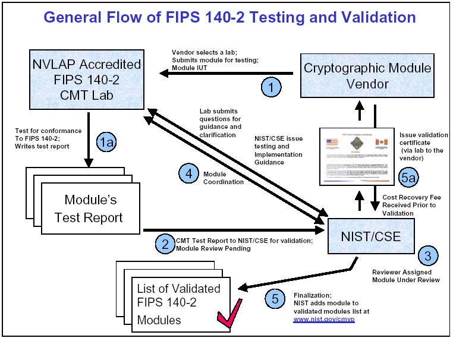
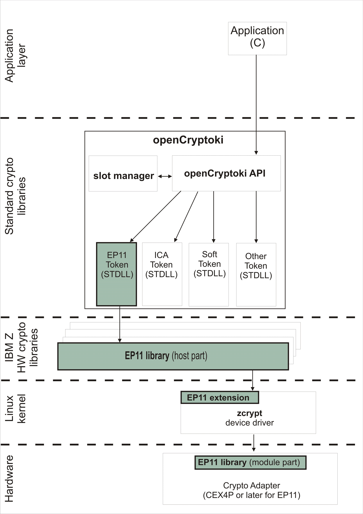
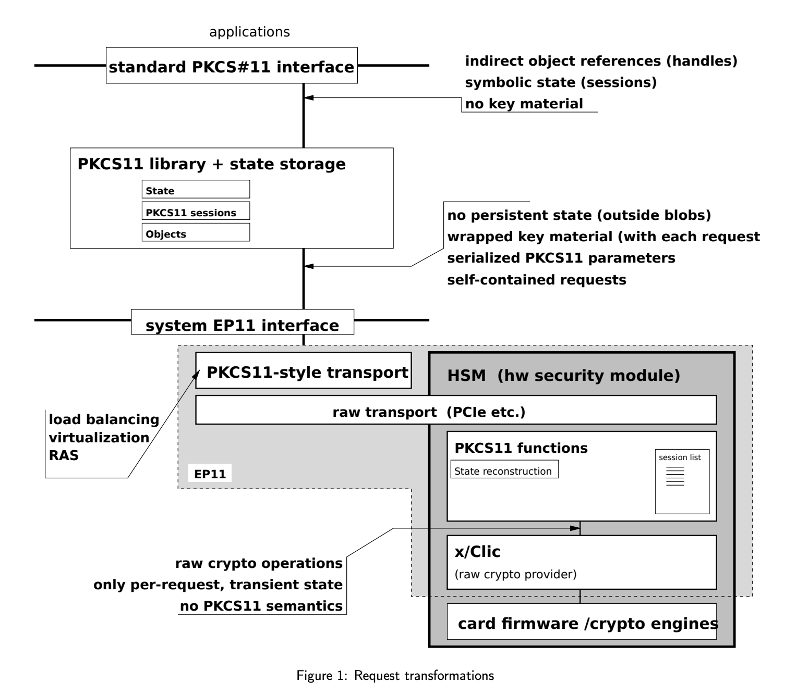

# Introduction to Cryptography concepts

## Concepts

### NIST

 National Institute of Standards and Technology, is a physical sciences laboratory, and a non-regulatory agency of the United States Department of Commerce. Its mission is to promote innovation and industrial competitiveness. NIST's activities are organized into laboratory programs that include nanoscale science and technology, engineering, information technology, neutron research, material measurement, and physical measurement. It was formerly known as the National Bureau of Standards.

### FIPS

The Federal Information Processing Standard (FIPS) Publication 140-2, (FIPS PUB 140-2), is a U.S. government computer security standard used to approve cryptographic modules. The title is Security Requirements for Cryptographic Modules. Initial publication was on May 25, 2001 and was last updated December 3, 2002.

- Security levels

FIPS 140-2 defines four levels of security, simply named "Level 1" to "Level 4". It does not specify in detail what level of security is required by any particular application.
Level 1

Security Level 1 provides the lowest level of security. Basic security requirements are specified for a cryptographic module (e.g., at least one Approved algorithm or Approved security function shall be used). No specific physical security mechanisms are required in a Security Level 1 cryptographic module beyond the basic requirement for production-grade components. An example of a Security Level 1 cryptographic module is a personal computer (PC) encryption board.
Level 2

Security Level 2 improves upon the physical security mechanisms of a Security Level 1 cryptographic module by requiring features that show evidence of tampering, including tamper-evident coatings or seals that must be broken to attain physical access to the plaintext cryptographic keys and critical security parameters (CSPs) within the module, or pick-resistant locks on covers or doors to protect against unauthorized physical access.
Level 3

In addition to the tamper-evident physical security mechanisms required at Security Level 2, Security Level 3 attempts to prevent the intruder from gaining access to CSPs held within the cryptographic module. Physical security mechanisms required at Security Level 3 are intended to have a high probability of detecting and responding to attempts at physical access, use or modification of the cryptographic module. The physical security mechanisms may include the use of strong enclosures and tamper-detection/response circuitry that zeroes all plaintext CSPs when the removable covers/doors of the cryptographic module are opened.
Level 4

Security Level 4 provides the highest level of security. At this security level, the physical security mechanisms provide a complete envelope of protection around the cryptographic module with the intent of detecting and responding to all unauthorized attempts at physical access. Penetration of the cryptographic module enclosure from any direction has a very high probability of being detected, resulting in the immediate deletion of all plaintext CSPs.

Security Level 4 cryptographic modules are useful for operation in physically unprotected environments. Security Level 4 also protects a cryptographic module against a security compromise due to environmental conditions or fluctuations outside of the module's normal operating ranges for voltage and temperature. Intentional excursions beyond the normal operating ranges may be used by an attacker to thwart a cryptographic module's defenses. A cryptographic module is required to either include special environmental protection features designed to detect fluctuations and delete CSPs, or to undergo rigorous environmental failure testing to provide a reasonable assurance that the module will not be affected by fluctuations outside of the normal operating range in a manner that can compromise the security of the module.

### PKCS#11

In cryptography, PKCS #11 is one of the ``Public-Key Cryptography Standards`,and also refers to the programming interface to create and manipulate cryptographic tokens.

The PKCS #11 standard defines a platform-independent API to cryptographic tokens, such as hardware security modules (HSM) and smart cards, and names the API itself "Cryptoki" (from "cryptographic token interface" and pronounced as "crypto-key" - but "PKCS #11" is often used to refer to the API as well as the standard that defines it).

The API defines most commonly used cryptographic object types (RSA keys, X.509 Certificates, DES/Triple DES keys, etc.) and all the functions needed to use, create/generate, modify and delete those objects.

### EP11

Enterprise PKCS#11, The EP11 library1 provides an interface very similar to the industry-standard PKCS#11 API. While the application-visible interface is essentially interchangeable, PKCS#11 manages sensitive data in a server-centric fashion. Unlike most PKCS#11 implementations, EP11 stores most secrets outside the crypto provider—secure hardware—in wrapped form, and backend devices are kept essentially stateless. Wrapped secrets are attached to PKCS#11 calls by a host library. Requests are dispatched as self-contained compounds, ready to be processed by any backend equipped with the necessary wrapping key.

### GREP11

EP11 over gRPC, Hyper Protect Crypto Services provides a set of EP11 APIs over gRPC calls, with which all the Crypto functions are executed in a Hardware Security Module (HSM) on the cloud. EP11 over gRPC is designed to be a stateless interface for cryptographic operations on cloud.

Hyper Protect Crypto Services leverages frameworks such as gRPC to enable remote application access. gRPC is a modern open source high performance remote procedure call (RPC) framework that can connect services in and across data centers for load balancing, tracing, health checking, and authentication. Applications access Hyper Protect Crypto Services by calling the EP11 API remotely through gRPC. For more information on gRPC, see the gRPC documentaion.

With the GREP11 APIs, you can perform the following operations:

- Key generation
- Encrypt and decrypt
- Sign and verify
- Wrap and unwrap keys
- Derive keys
- Build message digest
- Retrieve mechanism information

### gRPOC

In gRPC a client application can directly call methods on a server application on a different machine as if it was a local object, making it easier for you to create distributed applications and services. As in many RPC systems, gRPC is based around the idea of defining a service, specifying the methods that can be called remotely with their parameters and return types. On the server side, the server implements this interface and runs a gRPC server to handle client calls. On the client side, the client has a stub (referred to as just a client in some languages) that provides the same methods as the server.

gRPC clients and servers can run and talk to each other in a variety of environments - from servers inside Google to your own desktop - and can be written in any of gRPC’s supported languages. So, for example, you can easily create a gRPC server in Java with clients in Go, Python, or Ruby. In addition, the latest Google APIs will have gRPC versions of their interfaces, letting you easily build Google functionality into your applications.

## Reference

[FIPS 140-2](https://en.wikipedia.org/wiki/FIPS_140-2)
[PKCS#11](https://en.wikipedia.org/wiki/PKCS_11)
[EP11](https://www.ibm.com/downloads/cas/WXRDPRAN)
[GREP11](https://cloud.ibm.com/docs/services/hs-crypto?topic=hs-crypto-enterprise_PKCS11_overview&locale=dk#grep11_intro)
[gRPC](https://grpc.io/docs/guides/index.html)
https://www.ibm.com/support/knowledgecenter/en/linuxonibm/com.ibm.linux.z.lxce/lxce_stack.html
